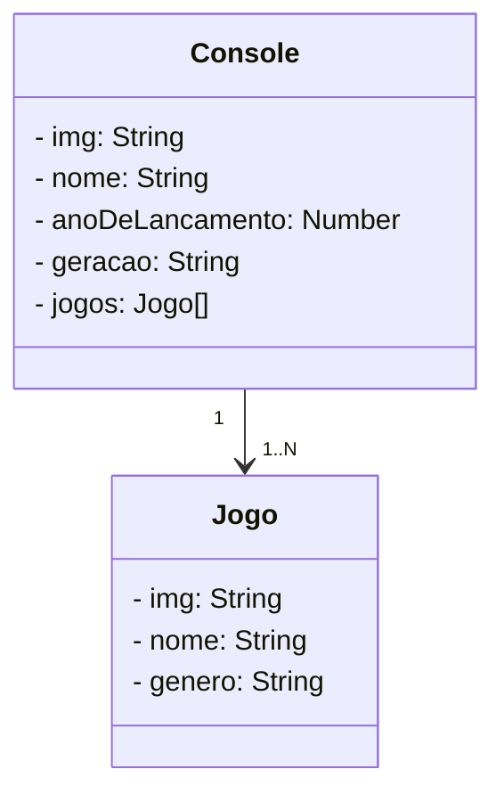

# API CONSOLES E JOGOS
Esse é um repositório java que gera uma API de consoles e jogos

```mermaid
classDiagram
    class Console {
        - img: String
        - nome: String
        - anoDeLancamento: Number
        - geracao: String
        - jogos: Jogo[]
    }

    class Jogo {
        - img: String
        - nome: String
        - genero: String
    }

    Console "1" --> "1..N" Jogo
```
